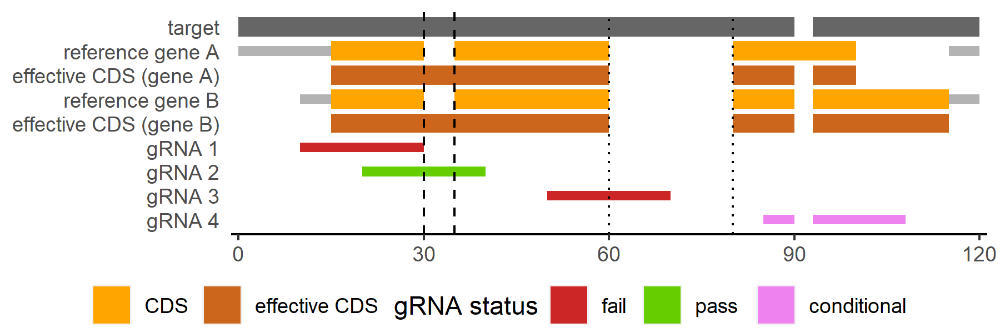

Algorithms
==========

Non-reference homologue inference
---------------------------------

Inferrence of homologues is a BLAST-based step that is controlled by 7 parameters: ``--minid``, ``--minlen``, ``--mincdslen``, ``--merge-within``, ``--check-id-before-merge``, ``--check-recip``, ``--relax-recip``

It consists broadly of 3 steps:

#. BLASTN of target reference genes to non-reference genomes

   * ``--check-id-before-merge`` (flag) and ``--minid``: remove hits below percentage ID specified using ``--minid``
   * Output: BLAST hits
    
#. Merge BLAST hits into candidate targets

   * ``--minlen``: remove candidate targets shorter than specified length (bp)
   * ``--mincdslen``: remove candidate targets with fewer than the specified bases covered by hits to CDS of reference genes
   * ``--minid``: remove candidate targets where none of the hits that were merged into it have a percentage ID equal to or greater than the specified value
   * Output: Candidate targets
    
#. Optional: reciprocal BLAST of candidate targets back to reference genome(s)

   * Filter candidate targets by whether they are more similar to target reference genes than any other non-target reference genes
   * Particularly useful if your target genes have very similar homologues
   * Use one of the following flags to turn ON this option:
     
     * ``--check-recip`` (flag): Remove candidate targets where the hit with the highest bitscore is to a non-target reference genes EVEN if  the hit overlaps with a target reference gene
     * ``--relax-recip`` (flag): Remove candidate targets where the hit with the highest bitscore is to a non-target reference genes ONLY if the hit DOES NOT overlap with a target reference gene
       
   * Output: Filtered candidate targets

Off-target assessment
---------------------

Off-target assessment is a BLAST-based step controlled by 2 parameters: ``--background``, ``--screen-ref``, ``--mask-gene``, ``--unmask-gene``, ``--ot-gap``, ``--ot-mismatch``

It consist broadly of 3 steps

#. Mask targets (and/or target reference genes) in background sequences

   * Masking allows gRNA with hits to the masked region to NOT be considered off-target
   * Only regions in background sequences with 100% identity across the FULL LENGTH of a target/gene to mask will be masked
     
     * If a sequence comprises only part of a target/gene to mask, it will NOT be masked
       
   * ``--mask-gene``: reference gene(s) to mask. By default, all genes passed to ``--gene`` are masked.
   * ``--unmask-gene``: reference gene(s) to unmask. By default, no genes passed to ``--gene`` are unmasked.
     
     * ``--unmask-gene`` has priority. If a gene appears in both ``--unmask-gene`` and ``--mask-gene``, it will NOT be masked.
   
   * Output: Ranges of masked regions in background sequences
   
#. BLASTN of gRNA to background sequences

   * Any files passed to ``--query`` will be included in this screen
   * ``--screen-ref`` (flag): include reference genome(s)
   * ``--background``: file(s) containing additional background sequences
   * Output: BLAST hits
   
#. Identify potentially problematic hits

   * Hits are subjected to the following tests in order:
     
      1. Hits fully in masked regions will be considered non-problematic
      2. Hits will be assessed for goodness of alignment using one of two algorithms (see :ref:`Algorithms:Off-target hit alignment goodness`)
      3. Optional: Hits that do not have a PAM pattern nearby will be considered non-problematic
         
         * ``--ot-pamless`` (flag): use this flag to turn this option OFF
   
   * Hits that are not considered non-problematic by AT LEAST ONE of the above test will be considered problematic
   * Output: Problematic BLAST hits
      
#. gRNA with hits that are problematic are considered to have failed off-target assessment
   
Off-target hit alignment goodness
~~~~~~~~~~~~~~~~~~~~~~~~~~~~~~~~~

MINORg has two different methods of determining whether an off-target alignment is "too good" (i.e. that a gRNA should be considered problematic). :ref:`Algorithms:Total mismatch/gap/unaligned` uses total non-matches for a gRNA hit, while :ref:`Algorithms:Position-specific mismatch/gap/unaligned` allows users to specify different thresholds for different positions along a gRNA.

Total mismatch/gap/unaligned
****************************

By default, MINORg uses this algorithm to define problematic off-target hits. This algorithm checks whether a gRNA has fewer mismatch(es)/gap(s)/unaligned positions across its entire length than a threshold value, and disqualifies any gRNA where it is true for at least one hit.

1. Hits that have a minimum number of gaps OR mismatches specified by the user will be considered non-problematic. Users may increase the thresholds for more stringent filtering.
         
   * ``--ot-gap``/\ ``ot_gap``: minimum number of gaps (default=1; minimum is 1)
   * ``--ot-mismatch``/\ ``ot_mismatch``: minimum number of mismatches (default=1; minimum is 1)
           
2. Hits where a gRNA is unaligned for a length that is greater than '(``--ot-gap`` - 1) + (``--ot-mismatch`` - 1) - <gaps in hit> - <mismatches in hit>' will be considered non-problematic
         
   * If ``--ot-gap 1 --ot-mismatch 1``, then a hit without gaps or mismatches must be perfectly aligned across the full length of a gRNA to be considered problematic
   * If ``--ot-gap 1 --ot-mismatch 2``, then a hit without gaps or mismatches must be perfectly aligned across at least <gRNA length>-1 bp to be considered problematic

Position-specific mismatch/gap/unaligned
****************************************

If ``--ot-pattern``/\ ``ot_pattern`` is specified, MINORg will use it to define problematic off-target hits. Unlike :ref:`Algorithms:Total mismatch/gap/unaligned`, this method takes into account WHERE a mismatch/gap/unaligned position occurs. See :ref:`Parameters:Off-target pattern` for how to build a pattern. However, where :ref:`Algorithms:Total mismatch/gap/unaligned` specifies the **LOWER-bound of NON-problematic** hits, this method specifies **UPPER-bound of PROBLEMATIC** hits.

1. Hits that do not match the pattern specified by ``--ot-pattern``/\ ``ot_pattern`` will be considered non-problematic.
   
   * ``--ot-unaligned-as-gap``: count unaligned positions as gaps (specifically as insertions) (default=False)
   * ``--ot-unaligned-as-mismatch``: count unaligned positions as mismatches (default=True)
   * WARNING: If both ``--ot-unaligned-as-gap`` and ``--ot-unaligned-as-mismatch`` are raised, unaligned positions will be double-counted as gap(s) AND mismatch(es).
   * If a deletion is between positions N and N+1 (5' -> 3'), it will be assigned to position:
     
     * N: if the range in the pattern uses negative position indices (e.g. 1g-5-\-10)
     * N+1: if the range in the pattern uses positive position indices (e.g. 1g5-10)

Within-feature inference
------------------------

MINORg aligns unannotated targets to annotated reference genes (supplied using ``--gene`` (CLI) or ``genes`` (Python)) in order to infer gene feature positions.

An alignment of an unannotated target sequence with 2 homologous reference genes is shown in the figure above. In this example, the desired feature in which to generate gRNA is the coding region (CDS).

* An effective feature (CDS in this case) range is generated for each target-reference pair separately
* Where there is an insertion relative to a reference gene, an effective feature (CDS in this case) range is only continuous across it if the insertion is smaller than a user-specified max_insertion length (``--max-insertion``/\ ``max_insertion``, default: 15 bp)
  
  * Using a max_insertion of 15 bp, the insertions marked by dashed (smaller than 15 bp) and dotted (larger than 15 bp) lines are included and excluded from the effective CDS range respectively
    
* The minimum requirement for a gRNA to pass this check is to fall entirely within at least one gene's effective feature (CDS in this case) range
* Users may adjust the threshold for minimum number/fraction of effective feature (CDS in this case) ranges a gRNA is required to be contained within to pass
  
  * If using ``--min-within-n``/\ ``min_within_n`` of 1
    
    * gRNA are required to fall entirely within only 1 gene's effective feature (CDS in this case) range
    * Both gRNA 2 and gRNA 4 pass
      
  * If using ``--min-within-fraction``/\ ``min_within_fraction`` of 1
    
    * gRNA are required to fall entirely within ALL genes' effective feature (CDS in this case) ranges
    * Only gRNA 2 passes
    * If parts of your genes are freqently pseudogenised, you may wish to set this value fairly high in order to ensure that most, if not all, gRNA are in conserved coding regions

Minimum set generation
----------------------

gRNA with equivalent set coverage (that is, that cover the exact same combination of targets) are collapsed to reduce computational redundancy.

WITHOUT prioritising non-redundancy
~~~~~~~~~~~~~~~~~~~~~~~~~~~~~~~~~~~

If ``--prioritise-pos``/ ``--prioritize-pos``/ ``MINORg.prioritise_nr = False``/ ``MINORg.prioritise_nr = False``.

Algorithm described in: Yang, Q., Nofsinger, A., Mcpeek, J., Phinney, J. and Knuesel, R. (2015). A Complete Solution to the Set Covering Problem. In International Conference on Scientific Computing (CSC) pp. 36–41

This algorithm prioritises coverage first, then proximity to 5' end of the sense strand. Non-redundancy is used as a tie-breaker. After every successful set, gRNA are removed from their respective collapsed groups. Collapsed groups with no remaining gRNA are removed, and the process is repeated with the remaining collapsed groups until either 1) the requested number of sets have been generated or 2) it is no longer possible to generate a set cover solution with the remaining gRNA.

Prioritising non-redundancy
~~~~~~~~~~~~~~~~~~~~~~~~~~~

If ``--prioritise-nr``/ ``--prioritize-nr``/ ``MINORg.prioritise_nr = True``/ ``MINORg.prioritise_nr = True``. Note that generation of sets when non-redundancy is prioritised is more computationally demanding (however, if there are few gRNA, the difference may not be noticeable) and may result in larger gRNA set sizes.

A combination of adapted approximate and optimal minimal weight cover algorithms are used when non-redundancy is prioritised. The approximate minimal weight set cover algorithm (implemented as :func:`~minorg.minweight_sc.enum_approx_order_SC`) is as described in: Ajami and Cohen (2019) Enumerating Minimal Weight Set Covers. Proceedings - International Conference on Data Engineering, 518-529

\ :func:`~minorg.minweight_sc.enum_approx_order_SC` starts with an empty set cover solution that the algorithm then proceeds to populate with potential sets to build a solution. It proceeds to enumerate set cover solutions in approximate order of increasing redundancy. For MINORg, :func:`~minorg.minweight_sc.enum_approx_order_SC` was adapted to allow starting with a set cover solution that has been seeded with a single set (which, in the case of MINORg, is a collapsed gRNA group) instead of an empty set cover solution. :func:`~minorg.minweight_sc.enum_approx_order_SC` was further adapted so that a limit can be set for the number of enumerated set cover solutions to return. That is, the function will terminate upon reaching the enumeration limit and return whatever solutions have already been enumerated regardless of whether it is still possible to generate more set cover solutions.

\ :func:`~minorg.minweight_sc.enum_approx_order_SC` is then wrapped in another function (:func:`~minorg.minimum_set.limited_minweight_SC`) that seeds it with different collapsed gRNA groups. In brief, :func:`~minorg.minimum_set.limited_minweight_SC` seeds :func:`~minorg.minweight_sc.enum_approx_order_SC` with higher coverage collapsed gRNA groups first and executes :func:`~minorg.minweight_sc.enum_approx_order_SC` to enumerate a limited number (max(20, 2*<num sets>)) of set cover solutions for each seeded group. The sizes and redundancy of set cover solutions generated by :func:`~minorg.minimum_set.limited_minweight_SC` are used to set thresholds for a more exhaustive search for optimal non-redundant set cover solutions (implemented as :func:`~minorg.minimum_set.limited_optimal_SC`).

#. :func:`~minorg.minimum_set.limited_minweight_SC` is executed with an enumeration limit of max(20, 2*<num sets>) using collapsed gRNA groups
   
   * Seeding begins with the collapsed gRNA group with the highest coverage and proceeds in order of decreasing coverage
   * The length of the max(10, 2*<num sets>) smallest solutions are tracked (size_threshold) and updated after every enumeration
   * Solutions that have size equal to or smaller than size_threshold are stored (candidate_approx_solutions)
     
     * If size_threshold decreases, set cover solutions in candidate_approx_solutions that do not meet the new threshold are removed
   
   * If the next collapsed gRNA group for seeding has a smaller coverage size than the current seeded collapsed gRNA group, the current collapsed gRNA group and all collapsed groups with equivalent coverage size will be removed from the pool of candidate collapsed gRNA groups after seeded_minweight_SC has been executed for the determined number of enumerations for the current seed and will not be used in set cover solutions for subsequent seeded_minweight_SC executions
   * This step terminates when the coverage of the next collapsed gRNA group to be seeded has a coverage size that is less than <total targets>/<size_threshold>

#. Two threshold values are obtained from solutions from the previous step to inform the search for optimal, low redundancy set cover solutions in the next step

   * Maximum set cover size: Size of largest set cover solution among candidate_approx_solutions
   * Maximum redundancy: Maximum redundancy among candidate_approx_solutions

     * Redundancy is calculated as: (sum(<coverage size> for all sets in a set cover solution) - <number of targets>)/<number of targets>

       * Where a "set" in a set cover solution is a collapsed gRNA group, and <coverage size> refers to the number of targets covered by the collapsed gRNA group

#. :func:`~minorg.minimum_set.limited_optimal_SC`, a primarily brute force search for optimal, low redundancy set cover solutions, is executed using thresholds from the above step

   * Sort collapsed gRNA groups in decreasing order of coverage size (sorted_groups)
   * Let candidate_optimal_solutions be a variable that stores set cover solutions
   * Let optimal_SC(C, i) be an internal function for recursively building a set cover solution

     * Parameters:

       * C is a (partial) set cover solution
       * i is an index within sorted_groups

     * Algorithm:

       * Abort if <number of sets in C> >= <maximum set cover size> AND <number of targets covered by C> < <number of targets>
       * Else for j in range(i, <length of sorted_groups>, 1):

         * Break out of loop if <length of the j-th collapsed gRNA group> < integer([(<number of targets> - <number of targets covered by C>) / (<maximum set cover size> - <number of sets in C>)] + 1)
         * Else skip to j+1 if targets covered by j-th collapsed gRNA group is a subset of targets covered by C
         * Else add the j-th collapsed gRNA group to C to generate a new (partial) set cover solution (C_new)

           * Skip to j+1 if <redundancy of C_new> > <maximum redundancy>
           * Else add C_new to candidate_optimal_solutions if C_new covers all targets
           * Else execute optimal_SC(C_new, j+1)
             
   * Execute ``optimal_SC(<empty set cover solution>, 0)`` (assuming 0-indexing)

#. Sort candidate_optimal_solutions in increasing order of set cover solution size (number of collapsed gRNA groups in a solution set) followed by increasing order of redundancy

   * While <number of sets output> < <number of sets requested>:

     * If candidate_optimal_solutions is empty (such as when user has manually discarded some gRNA):

       * If no candidate gRNA are left, abort
       * If some candidate gRNA are left, regenerate candidate_optimal_solutions using the reduced pool of candidate gRNA (i.e. repeat steps 1 to 3 with the reduced pool of candidate gRNA)

     * [a] Select the first set cover solution in sorted candidate_optimal_solutions

       * If the set cover solution contains one or more empty collapsed gRNA groups, remove it from sorted candidate_optimal_solutions and repeat step [a] onward
       * [b] For each collapsed gRNA group in the set cover solution, select the gRNA that is on average closest to the 5' end of the sense strand for all targets covered
       * Create a proposed gRNA set from the selected gRNA

         * If using ``--manual``/\ ``MINORg.manual=True`` and user chooses to discard a gRNA in the proposed set:

           * Remove discarded gRNA from its collapsed gRNA group

             * If no gRNA are left in the collapsed group, remove this set cover solution from sorted candidate_optimal_solutions and repeat the above steps from [a] onward
             * Else repeat the above steps from [b] onward
               
         * Else output the proposed set and remove gRNA in the set from their collapsed gRNA groups

   * Note that removing a gRNA from a collapsed gRNA group will also remove it from all equivalent collapsed gRNA groups in all set cover solutions to ensure that gRNA are not repeated
